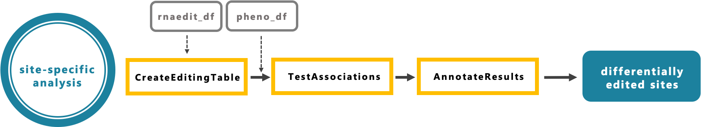
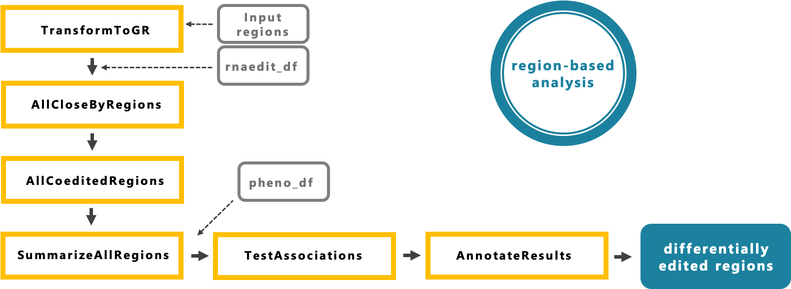

```{r setup, include=FALSE}
knitr::opts_chunk$set(echo = TRUE)
```

`rnaEditr` is an R package that identifies genomic sites and genomic regions 
that are differentially edited in RNA-seq datasets. `rnaEditr` can analyze 
studies with continuous, binary, or survival phenotypes, along with multiple 
covariates and/or interaction effects. To identify hyper-edited regions, 
`rnaEditr` first determines co-edited sub-regions without using any phenotype 
information. Next, `rnaEditr` tests association between RNA editing levels 
within the co-edited regions with binary, continuous or survival phenotypes. 


# 1 Installation 

The latest version can be installed by:

```{r eval = FALSE}
if(!requireNamespace("BiocManager", quietly = TRUE))
    install.packages("BiocManager")
BiocManager::install("rnaEditr")
```

After installation, the `rnaEditr` package can be loaded into R using:

```{r, message=FALSE}
library(rnaEditr)
```


# 2 Datasets

The input of `rnaEditr` are: (1) an RNA editing dataset, with rows 
corresponding to the edited sites and columns corresponding to the samples; (2) 
a phenotype dataset, with rows corresponding to different samples, ordered in 
the same way as columns of dataset (1); (3) a character string of genomic 
regions that users are interested in. This is only required for region-based 
analysis and will be explained in section 4.1.

The first dataset includes RNA editing levels for each sample at each edited 
site. RNA editing levels are typically defined as the total number of edited 
reads (i.e. reads with G nucleotides) divided by the total number of reads 
covering the site (i.e. reads with A and G nucleotides) (Breen et al. 2019 
PMID: 31455887). They range from 0 (un-edited site) to 1 (completely edited 
site).

We assume quality control and normalization of the RNA editing dataset have 
been performed, and that each site is edited in at least 5% of the samples. For 
illustration, we use a subset of the TCGA breast cancer RNA editing dataset 
(syn 2374375). This example dataset includes RNA editing levels for 272 edited 
sites mapped to genes *PHACTR4*, *CCR5*, *METTL7A* (using hg19 reference), 
along with a few randomly sampled sites, for 221 subjects.

```{r}
data(rnaedit_df)
```

```{r}
rnaedit_df[1:3, 1:3]
```

In order to link the RNA editing dataset with phenotype data, the phenotype 
dataset needs to have a column called `sample`,  whose values must be a exact 
match to the column names in the above RNA editing dataset.

```{r}
pheno_df <- readRDS(
  system.file(
    "extdata",
    "pheno_df.RDS",
    package = 'rnaEditr',
    mustWork = TRUE
  )
)
```

```{r}
pheno_df[1:3, 1:3]
```

Here we are using the command below to make sure `sample` variable in phenotype 
dataset has a exact match to the column names in the RNA editing dataset.

```{r}
identical(pheno_df$sample, colnames(rnaedit_df))
```

`rnaEditr` can perform both site-specific and region-based analysis. In Section 
3, we illustrate testing associations between cancer status and RNA editing 
levels at individual sites. In Section 4, we illustrate identifying cancer 
associated co-edited regions.


# 3 Site-specific analysis

{
width=100%}

## 3.1 Testing all edited sites

Before testing the associations, we use function `CreateEditingTable()` to turn 
RNA editing matrix into a dataframe with special class `rnaEdit_df`, which is 
a required format of input dataset for function `TestAssociations()`.  

```{r}
rnaedit2_df <- CreateEditingTable(
  rnaEditMatrix = rnaedit_df
)
```

In this example, we will test the association between cancer status (
`sample_type` variable from `pheno_df` dataset) and all edited sites. Because 
the outcome variable "cancer status" is a binary variable, `rnaEditr` will 
apply a logistic regression model for each site:
$$logit(Pr(cancer\;status = “yes”)) \sim RNA\;editing\;level$$

First, we use the command below to check the distribution of variable 
`sample_type`. Please note that `rnaEditr` will fit firth corrected logistic 
regression instead of regular logistic regression models for binary outcomes, 
when the minimum sample size per group is less than 10.

```{r}
table(pheno_df$sample_type)
```

```{r, results='hide'}
tumor_single_df <- TestAssociations(
  # an RNA editing dataframe with special class "rnaEdit_df" from function
  #   CreateEditingTable() if site-specific analysis, from function 
  #   SummarizeAllRegions() if region-based analysis.
  rnaEdit_df = rnaedit2_df,
  # a phenotype dataset that must have variable "sample" whose values are a 
  #   exact match to the colnames of "rnaEdit_df".
  pheno_df = pheno_df,
  # name of outcome variable in phenotype dataset "pheno_df" that you want to 
  #   test.
  responses_char = "sample_type",
  # names of covariate variables in phenotype dataset "pheno_df" that you want
  #   to add into the model.
  covariates_char = NULL,
  # type of outcome variable that you input in argument "responses_char".
  respType = "binary",
  # order the final results by p-values or not.
  orderByPval = TRUE
)
```

```{r}
tumor_single_df[1:3, ]
```

Here `tumor_single_df` is a data frame of all edited sites, with corresponding 
p-values and false discovery rate (FDRs) from the logistic regression model. 

## 3.2 Annotate results

We next annotate these results by adding gene names mapped to the RNA editing 
sites.

```{r message=FALSE}
tumor_annot_df <- AnnotateResults(
  # the output dataset from function TestAssociations().
  results_df = tumor_single_df,
  # close-by regions, since this is site-specific analysis, set to NULL.
  closeByRegions_gr = NULL,
  # input regions, since this is site-specific analysis, set to NULL.
  inputRegions_gr = NULL,
  genome = "hg19",
  # the type of analysis result from function TestAssociations(), since we are 
  #   running site-specific analysis, set to "site-specific".
  analysis = "site-specific"
)
```

```{r}
tumor_annot_df[1:3, ]
```

# 4 Region-based analysis

{
width=100%}

The region-based analysis consists of several steps: (1) make GRanges object 
for the genomic regions, (2) determine RNA editing sites that are located 
closely within the genomic regions, (3) identify co-edited regions, and (4) 
test the association between cancer status and co-edited regions.

## 4.1 Input regions 

First, we make GRanges object for the genomic regions that we are interested in
. We saved both hg19 and hg38 gene references in the package. The following 
command retrieves regions associated with 20,314 pre-processed hg19 genes.
To retrieve hg38 gene reference, easily change "hg19_annoGene_gr.RDS" 
into "hg38_annoGene_gr.RDS" in the command below.

```{r}
allGenes_gr <- readRDS(
  system.file(
    "extdata",
    "hg19_annoGene_gr.RDS",
    package = 'rnaEditr',
    mustWork = TRUE
  )
)
```

```{r}
allGenes_gr[1:3]
```

For candidate gene studies, we are often only interested in a few specific 
genes. We can use the following commands to extract GRanges associated with the 
specific genes: 

```{r}
# If input is gene symbol
inputGenes_gr <- TransformToGR(
  # input a character vector of gene symbols
  genes_char = c("PHACTR4", "CCR5", "METTL7A"),
  # the type of "gene_char". As we input gene symbols above, set to "symbol"
  type = "symbol",
  genome = "hg19"
)
```

```{r}
inputGenes_gr
```

If we're interested in particular regions, we can use the following commands to 
make GRanges.   

```{r}
# If input is region ranges
inputRegions_gr <- TransformToGR(
  # input a character vector of region ranges.
  genes_char = c("chr22:18555686-18573797", "chr22:36883233-36908148"),
  # the type of "gene_char". As we input region ranges above, set to "region".
  type = "region",
  genome = "hg19"
)

# Here we use AddMetaData() to find the gene symbols for inputRegions_gr.
AddMetaData(target_gr = inputRegions_gr, genome = "hg19")
```

## 4.2 Find close-by regions

Next, within each input candidate region, we identify the sub-regions that 
contain closely located RNA editing sites. At default, we identify sub-regions 
with at least 3 edited sites, for which maximum distance between two 
neighboring sites is 50 bp.

```{r, results="hide"}
closeByRegions_gr <- AllCloseByRegions(
  # a GRanges object of genomic regions retrieved or created in section 4.1.
  regions_gr = inputGenes_gr,
  # an RNA editing matrix.
  rnaEditMatrix = rnaedit_df,
  maxGap = 50,
  minSites = 3
)
```

```{r}
closeByRegions_gr
```

`closeByRegions_gr` is a GRanges object that includes sub-regions that contain 
closely located RNA editing sites (close-by regions). In this example, within 
the three input candidate regions, 8 close-by regions were found.

## 4.3 Find co-edited regions

Next, within each close-by region, we identify co-edited regions based on 
RNA editing levels. At default, a co-edited region needs to satisfy the 
following requirements: (1) with at least 3 edited sites; (2) the minimum 
correlation between RNA editing levels of one site and the mean RNA editing 
levels of the rest of the sites is at least 0.4; (3) the minimum pairwise 
correlation of sites within the selected cluster is at least 0.1.

```{r, results="hide"}
closeByCoeditedRegions_gr <- AllCoeditedRegions(
  # a GRanges object of close-by regions created by AllCloseByRegions().
  regions_gr = closeByRegions_gr,
  # an RNA editing matrix.
  rnaEditMatrix = rnaedit_df,
  # type of output data.
  output = "GRanges",
  rDropThresh_num = 0.4,
  minPairCorr = 0.1,
  minSites = 3,
  # the method for computing correlations.
  method = "spearman",
  # When no co-edited regions are found in an input genomic region, you want to
  #   output the whole region (when set to TRUE) or NULL (when set to FALSE).
  returnAllSites = FALSE
)
```

```{r}
closeByCoeditedRegions_gr
```

`closeByCoeditedRegions_gr` is a GRanges that contains co-edited regions within 
the close-by regions we found from last step. We identified 14 co-edited 
regions from the 8 close-by regions.

Let's take a look at correlations of RNA editing levels within the first 
co-edited region: 

```{r fig.height=6, fig.width=6}
PlotEditingCorrelations(
  region_gr = closeByCoeditedRegions_gr[1],
  rnaEditMatrix = rnaedit_df
)
```

## 4.4 Summarize all regions

Next, we summarize RNA editing levels from multiple edited sites within each 
co-edited region using medians.

```{r, results='hide'}
summarizedRegions_df <- SummarizeAllRegions(
  # a GRanges object of close-by regions created by AllCoeditedRegions().
  regions_gr = closeByCoeditedRegions_gr,
  # an RNA editing matrix.
  rnaEditMatrix = rnaedit_df,
  # available methods: "MaxSites", "MeanSites", "MedianSites", and "PC1Sites".
  selectMethod = MedianSites
)
```

```{r}
summarizedRegions_df[1:3, 1:5]
```

`summarizedRegions_df` is a data frame with each row corresponding to one 
co-edited region identified from function `AllCoeditedRegions()`. Since there 
are 14 co-edited regions, this data frame has 14 rows. In column 5 to the end, 
each column includes median editing levels (over all sites within each 
co-edited region) for one sample. 

## 4.5 Test all regions

Next, we test the association between cancer status and co-edited regions using 
logistic regression model:
$$logit (Pr(sample\;type = “cancer”)) \sim median\;RNA\;editing\;levels$$

```{r, results="hide"}
tumor_region_df <- TestAssociations(
  # an RNA editing dataframe with special class "rnaEdit_df" from function
  #   CreateEditingTable() if site-specific analysis, from function 
  #   SummarizeAllRegions() if region-based analysis.
  rnaEdit_df = summarizedRegions_df,
  # a phenotype dataset that must have variable "sample" whose values are a 
  #   exact match to the colnames of "rnaEdit_df".
  pheno_df = pheno_df,
  # name of outcome variable in phenotype dataset "pheno_df" that you want to 
  #   test.
  responses_char = "sample_type",
  # names of covariate variables in phenotype dataset "pheno_df" that you want
  #   to add into the model.
  covariates_char = NULL,
  # type of outcome variable that you input in argument "responses_char".
  respType = "binary",
  # order the final results by p-values or not.
  orderByPval = TRUE
)
```

```{r}
tumor_region_df[1:3, ]
```

Here `tumor_region_df` contains results for testing each co-edited region using 
logistic regression model. 

## 4.6 Annotate results

We next annotate results by adding the corresponding input regions, close-by 
regions and genes mapped to these genomic regions. 

```{r}
tumor_annot_df <- AnnotateResults(
  # the output dataset from function TestAssociations().
  results_df = tumor_region_df,
  # close-by regions which is a output of AllCloseByRegions().
  closeByRegions_gr = closeByRegions_gr,
  # input regions, which are created in section 4.1.
  inputRegions_gr = inputGenes_gr,
  genome = "hg19",
  # the type of analysis result from function TestAssociations(), since we are 
  #   doing region-based analysis, use default here.
  analysis = "region-based"
)
```

```{r}
tumor_annot_df[1:3, ]
```

To summarize this final dataset, values of column `inputRegion` are the 
user-specified candidate genomic regions, values of column `closeByRegion` are 
the regions that contain closely located RNA editing sites, and columns 
`seqnames`, `start`, `end` are the co-edited regions.  

# 5 Further examples of function `TestAssociations` in `rnaEditr`

`rnaEditr` can analyze different types of phenotypes, including binary, 
continuous and survival outcomes. In the last section, we analyzed a binary 
phenotype `sample_type`. We next illustrate analysis for continuous and 
survival phenotypes. 

For continuous outcome, as an example, to identify co-edited regions associated 
age, we use the following commands:

```{r, results="hide"}
tumor_region_df <- TestAssociations(
  # an RNA editing dataframe with special class "rnaEdit_df" from function
  #   CreateEditingTable() if site-specific analysis, from function 
  #   SummarizeAllRegions() if region-based analysis.
  rnaEdit_df = summarizedRegions_df,
  # a phenotype dataset that must have variable "sample" whose values are a 
  #   exact match to the colnames of "rnaEdit_df".
  pheno_df = pheno_df,
  # name of outcome variable in phenotype dataset "pheno_df" that you want to 
  #   test.
  responses_char = "age_at_diagnosis",
  # names of covariate variables in phenotype dataset "pheno_df" that you want
  #   to add into the model.
  covariates_char = NULL,
  # type of outcome variable that you input in argument "responses_char".
  respType = "continuous",
  # order the final results by p-values or not.
  orderByPval = TRUE
)
```

```{r}
tumor_region_df[1:3, ]
```

For survival outcome, for example, we use the following commands:

```{r, results="hide"}
tumor_region_df <- TestAssociations(
  # an RNA editing dataframe with special class "rnaEdit_df" from function
  #   CreateEditingTable() if site-specific analysis, from function 
  #   SummarizeAllRegions() if region-based analysis.
  rnaEdit_df = summarizedRegions_df,
  # a phenotype dataset that must have variable "sample" whose values are a 
  #   exact match to the colnames of "rnaEdit_df".
  pheno_df = pheno_df,
  # name of outcome variable in phenotype dataset "pheno_df" that you want to 
  #   test.
  responses_char = c("OS.time", "OS"),
  # names of covariate variables in phenotype dataset "pheno_df" that you want
  #   to add into the model.
  covariates_char = NULL,
  # type of outcome variable that you input in argument "responses_char".
  respType = "survival",
  # order the final results by p-values or not.
  orderByPval = TRUE
)
```

```{r}
tumor_region_df[1:3, ]
```

# 6 Session information

Here is the R session information for this vignette:

```{r,size = 'tiny'}
sessionInfo()
```


